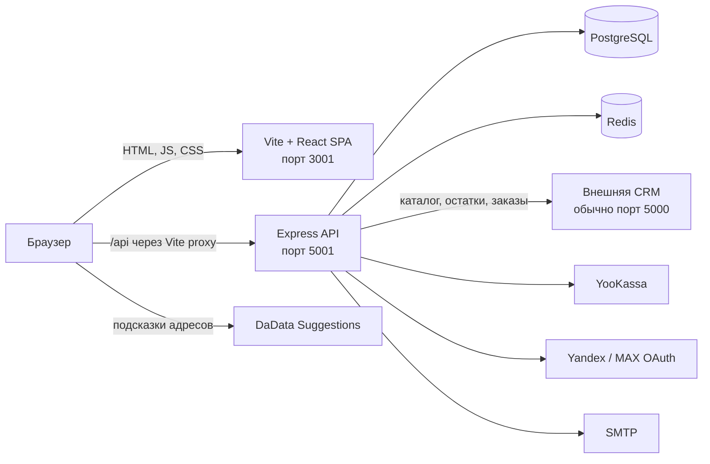
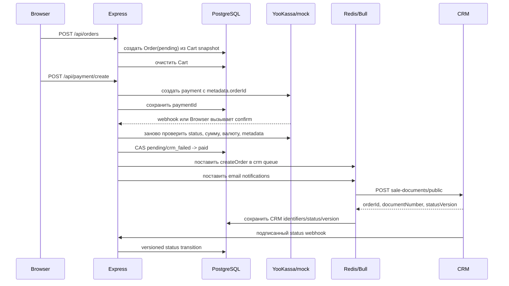

# Архитектура SWAPSERVICE38 Website

Этот документ описывает фактическое состояние репозитория на 19 августа 2026 года. Источником истины служит исполняемый код и конфигурация проекта; сохранённые, но не подключённые заготовки отмечены отдельно.

## 1. Назначение системы

Репозиторий содержит сайт SWAPSERVICE38: публичный каталог товаров и услуг, контентные страницы, корзину, оформление и оплату заказов, личный кабинет и административную панель. Товары и складские остатки принадлежат внешней CRM, а пользователи, корзины, локальные заказы, статьи, комментарии, услуги и настройки хранятся в собственной PostgreSQL.

Система состоит из двух запускаемых приложений:

- `frontend/` — одностраничное React-приложение, собираемое Vite;
- `backend/` — HTTP API на Express, одновременно выполняющее фоновые Bull-задачи.

PostgreSQL и Redis являются обязательными инфраструктурными зависимостями backend. CRM, YooKassa, OAuth-провайдеры, SMTP и DaData — внешние интеграции.



## 2. Структура репозитория

```text
.
├── backend/
│   ├── src/
│   │   ├── config/       # Redis и структурированное логирование
│   │   ├── controllers/  # HTTP-обработчики, включая admin
│   │   ├── middleware/   # auth, роли, CSRF, validation, errors, rate limit
│   │   ├── queues/       # очередь синхронизации заказов с CRM
│   │   ├── routes/       # Express Router по областям API
│   │   ├── schemas/      # входные Zod-схемы
│   │   ├── services/     # auth, cart, order, payment, CRM, email, OAuth
│   │   ├── utils/        # статусы заказов, HTML sanitizer, internal API key
│   │   └── server.ts     # composition root и точка входа API
│   ├── prisma/
│   │   ├── schema.prisma # модель PostgreSQL
│   │   └── migrations/   # история миграций
│   ├── docs/openapi.yaml # частичная документация HTTP API
│   ├── tests/            # unit и integration тесты Jest
│   └── uploads/          # локальное файловое хранилище загруженных изображений
├── frontend/
│   ├── src/
│   │   ├── app/          # компоненты страниц, сгруппированные по URL/области
│   │   ├── components/   # общие публичные и административные компоненты
│   │   ├── lib/          # hooks, contexts, CSRF, cache, Next compatibility shims
│   │   ├── App.tsx       # таблица маршрутов React Router
│   │   └── main.tsx      # точка входа Vite и глобальные providers
│   ├── public/           # статические изображения и старые article uploads
│   └── tests/            # unit, integration API и e2e-сценарии
├── tests/load/           # k6-нагрузочные сценарии и сохранённые результаты
└── docker-compose.yml    # предполагаемая локальная топология сервисов
```

## 3. Frontend

### 3.1. Фактический runtime

Frontend запускается командами `vite`, `tsc && vite build` и `vite preview` из `frontend/package.json`. Точка входа — `frontend/src/main.tsx`, маршрутизация — `BrowserRouter` в `frontend/src/App.tsx`. Все страницы рендерятся на клиенте; серверного рендеринга и Next App Router в текущем runtime нет.

Каталог `src/app`, директивы `'use client'`, `frontend/next.config.js` и Jest-конфигурация через `next/jest` остались от Next-подобной структуры. Для совместимости компоненты импортируют `Link`, `Image`, `useRouter`, `usePathname` и `useParams` из `src/lib/next-shims.ts`, где они адаптированы к React Router и обычному ``.

Vite dev server работает на порту `3001` и проксирует `/api` на `http://localhost:5001`. Alias `@` указывает на `frontend/src`.

### 3.2. Композиция и состояние

`main.tsx` оборачивает приложение в:

1. `QueryClientProvider` — кэш серверных запросов TanStack Query;
2. `CartProvider` — один экземпляр клиентского состояния корзины;
3. `BrowserRouter` внутри `App` — клиентская навигация.

`useCart` загружает `/api/cart`, хранит представление корзины и вызывает мутации через CSRF-aware fetch. `useAuth` проверяет `/api/auth/me`, кэширует пользователя в пределах экземпляра hook и реализует logout. Единого глобального AuthProvider нет: разные компоненты создают собственные экземпляры `useAuth`.

TanStack Query и devtools подключены глобально, но страницы и hooks текущей ревизии не используют `useQuery`/`useMutation`: server state фактически загружается ручными `fetch` + `useEffect` и хранится в локальном state. `src/lib/cache.ts` также не включён в активный поток.

### 3.3. Группы маршрутов

| Область | URL | Layout |
|---|---|---|
| Публичная | `/`, `/catalog`, `/catalog/:id`, `/cart`, `/contacts`, `/services`, `/services/:id`, `/swaps`, `/swaps/:id`, `/offer`, `/privacy`, `/payment/*` | `SiteHeader` + контент + `SiteFooter` |
| Авторизация | `/login`, `/register`, `/verify`, `/reset-password/*`, `/oauth-*` | полноэкранные страницы без общего header/footer |
| Профиль | `/profile`, `/profile/change-password`, `/profile/orders`, `/profile/orders/details` | публичный layout |
| Администрирование | `/admin`, `/admin/orders/*`, `/admin/users/*`, `/admin/settings`, `/admin/content/*` | `AdminLayout` |

`AdminLayout` загружает текущего пользователя и показывает UI только для роли `admin`. Серверный `requireAdmin` допускает роли `admin` и `manager`, поэтому права UI и API сейчас не полностью совпадают.

Catch-all route для 404 не зарегистрирован. Файлы `src/app/error.tsx` и error-файлы групп, `src/app/providers.tsx`, пустой `AdminRoute.tsx`, а также отдельные admin `Sidebar.tsx`/`TopBar.tsx` не подключены в фактическую композицию из `main.tsx`/`App.tsx`.

### 3.4. Работа с API

Frontend использует относительные URL `/api/...` и преимущественно ручной `fetch`; React Query provider настроен, но его query/mutation API фактически не задействован. Все cookie-зависимые запросы отправляются с `credentials: 'include'` либо работают через same-origin proxy.

Для изменяющих запросов `src/lib/csrf.ts`:

- получает token через `GET /api/csrf-token`;
- кэширует его в памяти на четыре минуты;
- добавляет `X-CSRF-Token`, `CSRF-Token` и `_csrf` в JSON/FormData;
- всегда включает cookies.

Из внешних API браузер напрямую вызывает DaData Suggestions в `AddressInput`; ключ берётся из `VITE_DADATA_API_KEY`. OAuth-кнопки переходят на backend, используя `VITE_BACKEND_URL` либо `http://localhost:5001`.

## 4. Backend

### 4.1. Запуск и HTTP pipeline

`backend/src/server.ts` создаёт Express-приложение и экспортирует его для тестов. При прямом запуске оно слушает `PORT` (по умолчанию `5001`). Порядок middleware существенен:

1. CORS с credentials и фиксированным списком production/local origins;
2. compression, кроме webhook-путей;
3. Helmet и cookie parser;
4. raw body для `/api/payment/webhook`, затем JSON/urlencoded parsers;
5. request logging;
6. Swagger UI на `/api-docs`, если найден `docs/openapi.yaml`;
7. глобальная CSRF-проверка;
8. доменные routers;
9. раздача локального `backend/uploads` по `/uploads`;
10. 404 и глобальный error handler.

При старте обязательно явно выбрать `PAYMENT_PROVIDER=mock|yookassa`. В production mock запрещён, а backend дополнительно проверяет JWT/internal/webhook secrets и production-ключи YooKassa.

### 4.2. Слои

- Routes задают URL и локальные middleware.
- Controllers разбирают HTTP-запрос, проверяют владение ресурсом и формируют ответ.
- Services инкапсулируют бизнес-операции и внешние вызовы, но граница соблюдается не везде: часть controllers обращается к Prisma и CRM напрямую.
- Prisma используется как data access layer. В проекте создаётся несколько независимых `PrismaClient`, общего singleton пока нет.
- Bull queues выполняются в том же Node.js-процессе, потому что modules очередей импортируются API-приложением.

### 4.3. Области API

| Prefix | Ответственность | Доступ |
|---|---|---|
| `/api/auth` | регистрация, email verification, login/logout, профиль, пароль, Yandex/MAX OAuth | смешанный |
| `/api/products` | каталог, карточка и категории, проксируемые из CRM | публичный GET |
| `/api/cart` | гостевая и пользовательская корзина | optional auth, CSRF для мутаций |
| `/api/orders` | создание и чтение собственных заказов | authenticated |
| `/api/payment` | создание/подтверждение платежа, status, resend, webhook | смешанный |
| `/api/webhooks` | входящие статусы заказов из CRM | HMAC webhook |
| `/api/articles`, `/api/comments`, `/api/likes` | контент, комментарии, реакции | чтение публичное, запись по auth/role |
| `/api/services` | опубликованные услуги | публичный GET |
| `/api/admin` | dashboard, заказы, пользователи, контент, услуги, настройки, CRM queue | `admin` или `manager` на backend |
| `/api/upload` | загрузка изображений в локальный каталог | `admin` или `manager` |
| `/api/csrf-token`, `/api/health`, `/api-docs` | служебные endpoints | публичный GET |

Входные auth/order/cart payloads частично проверяются Zod через `validate` middleware. Административные controllers содержат дополнительные ручные проверки.

## 5. Данные и владение ими

### 5.1. PostgreSQL / Prisma

Основные модели из `backend/prisma/schema.prisma`:

- `User` — локальная учётная запись, роли `user|manager|admin`, профиль, блокировка и Yandex/MAX identifiers;
- `Session` — табличная модель сессии, но текущая аутентификация её не создаёт и проверяет JWT напрямую;
- `Cart` — одна JSON-корзина на `userId` либо `guestId`;
- `Order` — локальный снимок клиента, доставки, JSON-позиций, суммы, оплаты и CRM identifiers/version;
- `Article`, `ArticleTag`, `ArticleTagRelation`, `ArticleImage` — публикации, теги и галерея;
- `Comment` — древовидные комментарии к статьям;
- `Like` — уникальная реакция пользователя на статью;
- `Service` — локально управляемая услуга;
- `Setting` — key/value настройки сайта.

`Order.items` и `Cart.items` — JSON snapshots. Это осознанно отделяет историю заказа и корзину от внешнего каталога: в локальной БД нет модели Product и внешнего ключа на товар CRM.

### 5.2. Внешняя CRM

CRM является источником истины для товаров, категорий, цен и остатков. Активный `product.controller.ts` запрашивает CRM напрямую и нормализует различные варианты её ответа. Добавление и изменение количества в корзине повторно запрашивает карточку товара и проверяет актуальный остаток.

После успешной оплаты локальный заказ отправляется в CRM через очередь `crm queue`. Ответ CRM записывает в заказ `crmOrderId`, `orderNumber`, начальный status и `crmStatusVersion`. Последующие статусы приходят на `/api/webhooks/crm/order-status`.

CRM webhook:

- проверяет HMAC-SHA256 из `X-Webhook-Signature`;
- переводит CRM status в локальный status;
- требует монотонную целочисленную `version`;
- применяет обновление compare-and-swap по `crmStatusVersion`;
- отклоняет запрещённые переходы состояния;
- идемпотентно ставит email-уведомление клиенту.

### 5.3. Redis

Redis используется сразу в нескольких ролях:

- backend обязан подключиться к нему при загрузке `config/redis.ts`; после десяти неудачных reconnect-попыток процесс завершается;
- Bull хранит очереди `crm queue` и `email queue`;
- auth хранит verification/reset/change-password codes с TTL;
- payment flow хранит короткую processing lock и семидневный processed marker;
- статьи используют Redis для дедупликации просмотров;
- email service использует ключи идемпотентности уведомлений;
- вспомогательные CRM/product services содержат кэш, хотя активный product controller намеренно работает без него.

CSRF tokens, в отличие от перечисленного, хранятся в локальном `Map` процесса на пять минут, а не в Redis.

### 5.4. Файлы

Администратор/менеджер загружает изображения через Multer. Допускаются JPEG, PNG, WebP, GIF и SVG до 10 MB. Файлы записываются в `backend/uploads` и раздаются backend как `/uploads/<filename>`. В Docker volume для uploads не объявлен, поэтому сохранность файлов зависит от способа запуска контейнера.

`frontend/public/uploads/articles` — отдельный набор уже включённых в frontend статических изображений; runtime upload туда не пишет.

## 6. Ключевые потоки

### 6.1. Аутентификация

1. При регистрации backend хэширует пароль, создаёт `User` и кладёт шестизначный verification code в Redis; email ставится в Bull queue.
2. После подтверждения `User.isVerified` обновляется в PostgreSQL.
3. Login проверяет пароль/блокировку, выпускает JWT и устанавливает его в `httpOnly`, `sameSite=lax` cookie `token` на семь дней.
4. `requireAuth` также принимает `Authorization: Bearer`, валидирует JWT, заново читает пользователя из БД и запрещает заблокированные аккаунты.
5. Yandex/MAX OAuth обменивает code через provider API, связывает/создаёт пользователя, устанавливает тот же JWT cookie и возвращает браузер на frontend.
6. Если существовала гостевая корзина, login/OAuth переносят её в корзину пользователя.

### 6.2. Корзина

1. Неавторизованному посетителю backend создаёт UUID в `httpOnly` cookie `guestId` и строку `Cart` по `guestId`.
2. Авторизованный посетитель получает `Cart` по `userId`.
3. При добавлении/обновлении backend читает товар из CRM, проверяет наличие и сохраняет snapshot товара в `Cart.items`.
4. При login гостевые позиции объединяются с пользовательскими по `productId`, затем гостевая корзина удаляется.

### 6.3. Заказ, платёж и CRM



Заказ может создавать только авторизованный пользователь. Его позиции и итог берутся из серверной корзины, а не доверяются входному body. Создание локального заказа и его оплата разделены.

`PAYMENT_PROVIDER=mock` доступен только вне production и хранит mock payments в памяти процесса. `PAYMENT_PROVIDER=yookassa` создаёт платежи через API YooKassa с idempotence key. Redirect на success page сам по себе не считается подтверждением: backend повторно запрашивает платёж и сверяет payment id, status `succeeded`, RUB, сумму и `metadata.orderId`. Та же серверная перепроверка выполняется для webhook YooKassa.

Успешная обработка оплаты защищена Redis markers и условным обновлением status в PostgreSQL. CRM job имеет стабильный id по локальному order id, пять попыток с exponential backoff и после исчерпания попыток переводит заказ в `crm_failed`. Администратор может повторно поставить failed jobs или повторно отправить конкретный заказ.

## 7. Безопасность

- JWT хранится в `httpOnly` cookie; Bearer оставлен как альтернативный транспорт.
- Все mutating-запросы после глобального CSRF middleware требуют token, кроме явно разрешённых auth/webhook paths.
- CSRF session идентифицируется cookie `sessionId`, иначе IP; хранилище process-local, поэтому без sticky sessions несколько backend instances несовместимы с текущей реализацией.
- Admin API всегда проходит `requireAuth` и role check.
- CRM outbound requests подписываются `X-API-Key` из `INTERNAL_API_KEY`.
- CRM status webhook использует HMAC secret и timing-safe comparison.
- YooKassa notifications рассматриваются как сигнал: авторитетные данные повторно читаются из YooKassa.
- Статьи перед сохранением очищаются через `sanitize-html`.
- Helmet, CORS и общие error handlers подключены глобально.

`rateLimiter.middleware.ts` содержит набор limiter-ов, но `server.ts` и routes их сейчас не подключают; фактического rate limiting в runtime нет.

## 8. Конфигурация

Ключевые backend variables:

| Группа | Variables |
|---|---|
| Runtime/DB | `NODE_ENV`, `PORT`, `DATABASE_URL`, `LOG_LEVEL` |
| Redis | `REDIS_HOST`, `REDIS_PORT`, `REDIS_PASSWORD` |
| Auth | `JWT_SECRET`, `JWT_EXPIRES_IN` |
| URLs/secrets | `CLIENT_URL`, `API_URL`, `CRM_API_URL`, `INTERNAL_API_KEY`, `WEBHOOK_SECRET` |
| Payment | `PAYMENT_PROVIDER`, `YOO_KASSA_SHOP_ID`, `YOO_KASSA_SECRET_KEY` |
| Email | `SMTP_HOST`, `SMTP_PORT`, `SMTP_SECURE`, `SMTP_USER`, `SMTP_PASS`, `EMAIL_FROM`, `MANAGER_EMAIL` |
| OAuth | `YANDEX_CLIENT_ID`, `YANDEX_CLIENT_SECRET`, `YANDEX_REDIRECT_URI`, `MAX_CLIENT_ID`, `MAX_CLIENT_SECRET`, `MAX_REDIRECT_URI` |

Frontend compile-time variables: `VITE_BACKEND_URL`, `VITE_DADATA_API_KEY`; в type declarations также объявлены `VITE_API_URL`, `VITE_YANDEX_REDIRECT_URI`, `VITE_YANDEX_GEOCODER_API_KEY`, но активный код их не читает.

## 9. Сборка, запуск и тесты

Backend:

- `npm run dev` — nodemon + tsx;
- `npm run build` — TypeScript в `dist`;
- `npm start` — `node dist/server.js`;
- `npm test` — Jest/ts-jest последовательно, с Prisma mock и test helpers.

Frontend:

- `npm run dev` — Vite;
- `npm run build` — typecheck и Vite build;
- `npm run preview` — preview собранного SPA.

Backend Jest запускает TypeScript-тесты через ts-jest последовательно и подменяет Prisma mock-ом. Скомпилированные `.js/.d.ts/.map` копии под `backend/tests` исключены конфигурацией и не являются отдельными выполняемыми наборами. Frontend содержит имена unit/integration/e2e тестов, но эти файлы в текущем checkout пусты; кроме того, `package.json` не объявляет test/e2e scripts и Jest/Playwright dependencies, а `jest.config.js` требует отсутствующий `next/jest`. Фактически запускаемого frontend test suite сейчас нет. Отдельно присутствуют k6 load scripts и сохранённые результаты в `tests/load`.

`docker-compose.yml` описывает Redis, PostgreSQL, backend и frontend в одной bridge network; отдельного CRM service в нём нет. Фактическая Docker-сборка в текущем checkout неполна: compose ожидает `backend/Dockerfile` и `frontend/Dockerfile`, тогда как присутствует только `backend/Dockerfile.dev`. Этот dev-файл выставляет порт `5000`, а runtime использует `5001`. Compose также не задаёт обязательный `PAYMENT_PROVIDER` и передаёт `NEXT_PUBLIC_BACKEND_URL`, который Vite runtime не использует. Compose следует считать описанием предполагаемой топологии, а не проверенным способом сборки текущей ревизии.

## 10. Известные архитектурные несоответствия

Это наблюдения по текущему коду, а не предложения по изменению:

- Проект мигрировал с Next-подобной структуры на Vite, но `next.config.js`, `next/jest`, `src/app/providers.tsx`, `'use client'` и комментарии про Next ещё присутствуют.
- `frontend/index.html`/Vite и `src/main.tsx` являются реальными точками входа; файловая структура `src/app/**/page.tsx` сама по себе маршруты не создаёт.
- Собственный `next-shims.ts` покрывает только используемый минимум Next API; в частности, `useParams` возвращает последний сегмент URL как `id`, а не является общим эквивалентом именованных параметров React Router.
- Frontend содержит страницы `/admin/content/news` и вызывает `/api/admin/news`, но backend таких routes не регистрирует. В модели Article есть только типы, фактически используемые для `swap` и `service`.
- Frontend settings вызывает `POST /api/admin/settings/clear-cache`, которого нет в `admin.routes.ts`.
- Frontend admin layout допускает только `admin`, тогда как backend admin middleware допускает `admin` и `manager`.
- Переход гостя из checkout ведёт на `/login?redirect=/cart`, но login/register не обрабатывают `redirect` и после входа отправляют пользователя на `/`; автоматический возврат в checkout не завершён.
- Общий header содержит статический список категорий, тогда как страница каталога получает категории из CRM; источники могут расходиться.
- `Session` существует в Prisma и очищается при удалении пользователя, но JWT login/logout не использует эту таблицу и не ведёт server-side session registry.
- `product.service.ts` содержит mock-каталог и Redis cache, `crm.service.ts` — другой CRM abstraction, но активные product routes используют прямой `product.controller.ts`. Аналогично часть order/cart логики продублирована между controllers и services.
- Создаётся несколько `PrismaClient`; connection lifecycle централизован только частично.
- Bull workers встроены в API-процесс. Горизонтальное масштабирование увеличит число workers, а process-local CSRF/mock-payment state потребует отдельного решения.
- Redis connection для основного клиента учитывает пароль, но конструкторы Bull queues передают только host/port; при Redis с `requirepass` это требует проверки/донастройки.
- В `docker-compose.yml` healthcheck Redis вызывает `redis-cli ping` без пароля при включённом `requirepass`.
- Для `backend/Dockerfile.dev` нет `.dockerignore`; при его явном использовании весь backend directory становится build context, включая локальные неигнорируемые Docker-ом файлы.
- OpenAPI-файл существует, но полноту и синхронность с перечисленными runtime routes код автоматически не проверяет.

## 11. Где вносить изменения

| Задача | Основные файлы |
|---|---|
| Добавить/изменить страницу или URL | `frontend/src/App.tsx`, затем соответствующий `frontend/src/app/**/page.tsx` |
| Изменить общую оболочку сайта | `frontend/src/App.tsx`, `frontend/src/components/site-header.tsx`, `site-footer.tsx` |
| Изменить клиентское состояние корзины/auth | `frontend/src/lib/hooks`, `frontend/src/lib/context` |
| Добавить endpoint | `backend/src/routes`, controller, при необходимости schema/service и регистрация в `server.ts` |
| Изменить модель данных | `backend/prisma/schema.prisma` и новая migration |
| Изменить каталог/остатки | `backend/src/controllers/product.controller.ts`, `cart.controller.ts`, контракт внешней CRM |
| Изменить checkout/payment | `order.controller.ts`, `payment.controller.ts`, `payment.service.ts`, `crmOrderPayload.service.ts` |
| Изменить синхронизацию CRM | `backend/src/queues/crm.queue.ts`, `webhook.controller.ts`, `utils/orderStatus.ts` |
| Изменить письма | `backend/src/services/email.service.ts` |
| Изменить роли и доступ | `auth.middleware.ts`, `role.middleware.ts`, frontend `AdminLayout.tsx` |
