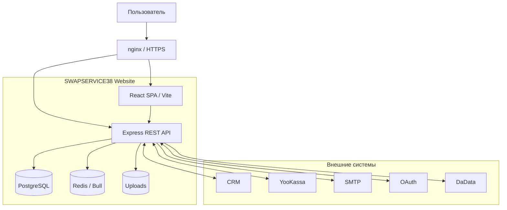
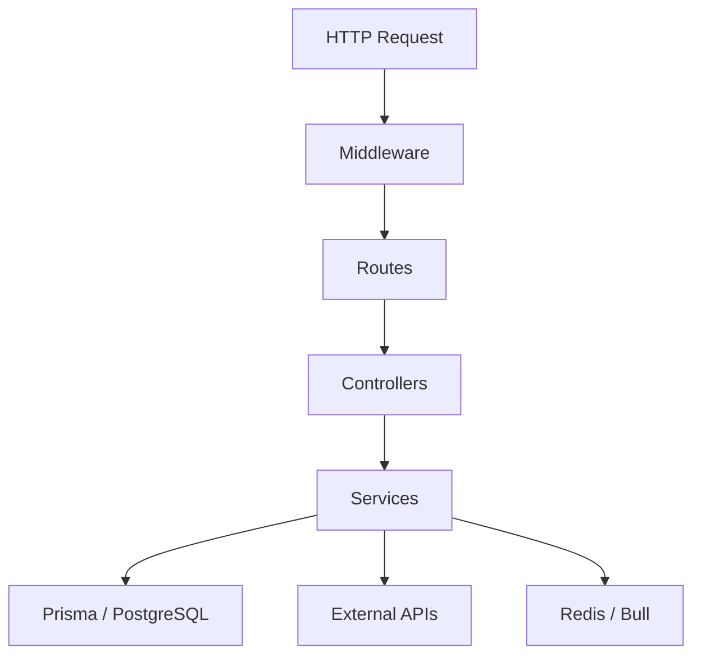
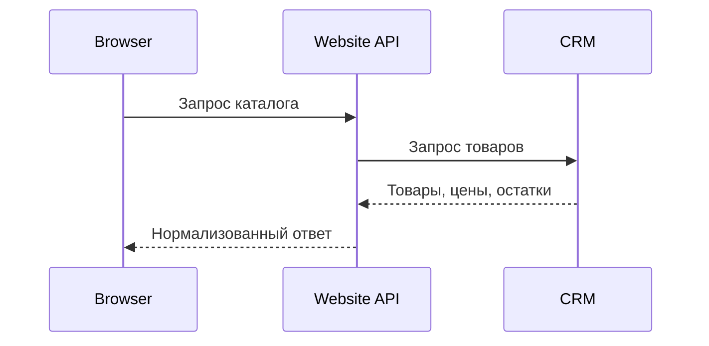
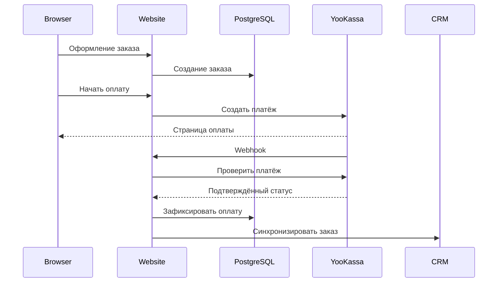
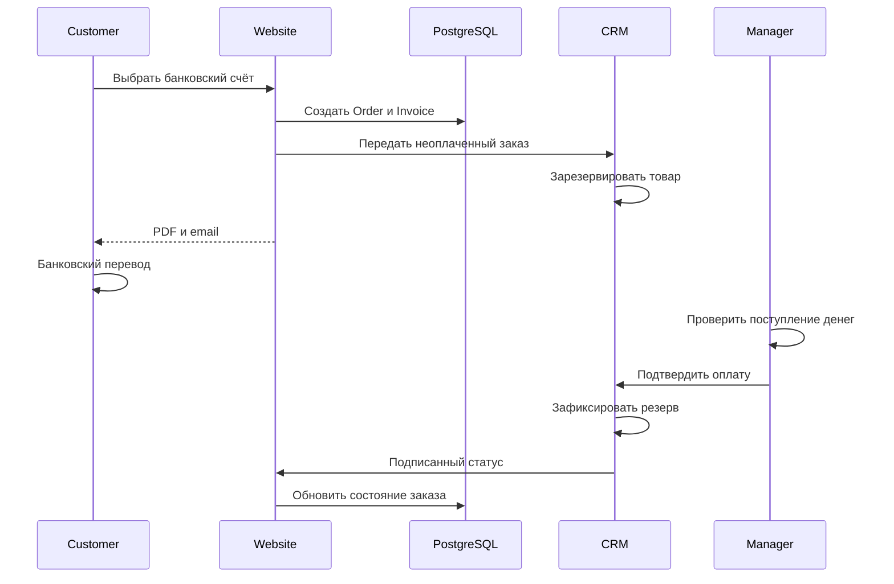
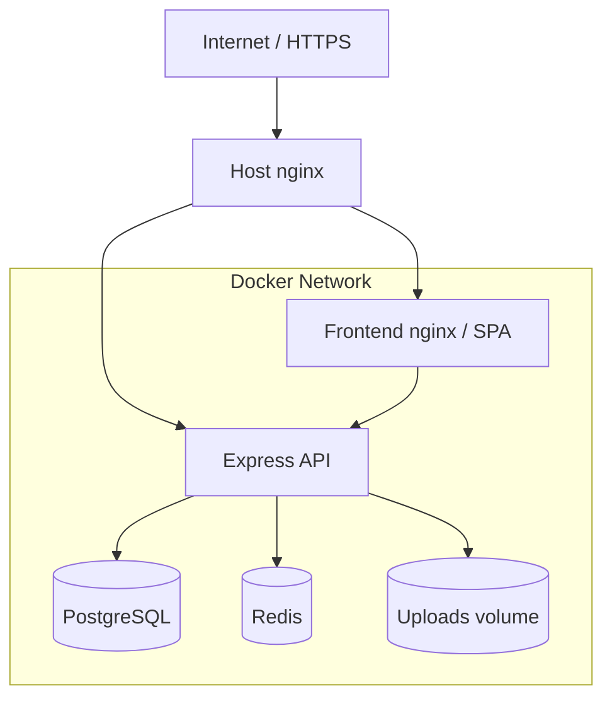

# Архитектура SWAPSERVICE38

**Проект:** SWAPSERVICE38 Website  
**Production:** https://swap38.ru  
**Репозиторий:** https://github.com/Mikhail1708/swapservice38-website  
**Основной язык:** TypeScript  
**Тип:** Full-stack e-commerce / Automotive Services  
**Статус:** Production  
**Актуализация документации:** 5 октября 2026 года

---

## 1. Обзор проекта

**SWAPSERVICE38** — веб-платформа для автомобильного сервиса, специализирующегося на свапах, ремонте автомобилей, производстве и продаже компонентов для тюнинга.

Проект разработан как полноценная коммерческая система и объединяет:

- Интернет-магазин автомобильных комплектующих.
- Каталог услуг автосервиса.
- Публикации о свапах и выполненных работах.
- Регистрацию и авторизацию пользователей.
- Корзину и оформление заказов.
- Онлайн-оплату через YooKassa.
- Выставление счетов для банковских переводов.
- Административную панель.
- Синхронизацию заказов и остатков с CRM.
- Email-уведомления и документы.
- SEO-инфраструктуру.

Система состоит из двух основных приложений в данном репозитории:

- `frontend/` — клиентское React-приложение.
- `backend/` — серверное Express API.

Отдельная CRM является самостоятельной системой и не входит в состав этого репозитория.

## 2. Технологический стек

| Уровень | Технологии |
|---|---|
| Frontend | React, TypeScript, Vite |
| Маршрутизация | React Router |
| UI | Tailwind CSS |
| Backend | Node.js, Express, TypeScript |
| Validation | Zod |
| ORM | Prisma |
| Database | PostgreSQL |
| Cache / Queues | Redis, Bull |
| HTTP Security | Helmet, CORS, CSRF |
| Authentication | JWT, cookies, OAuth |
| Payments | YooKassa, Bank Invoice |
| Email | SMTP |
| Deployment | Docker, Docker Compose |
| Reverse Proxy | nginx |
| Hosting | Linux VPS |

## 3. Общая архитектура


```mermaid
flowchart TB
    U["Пользователь"]
    N["nginx / HTTPS"]

    subgraph WEB["SWAPSERVICE38 Website"]
        F["React SPA / Vite"]
        A["Express REST API"]
        DB[("PostgreSQL")]
        R[("Redis / Bull")]
        FS[("Uploads")]
    end

    subgraph EXT["Внешние системы"]
        CRM["CRM"]
        PAY["YooKassa"]
        MAIL["SMTP"]
        OAUTH["OAuth"]
        ADDRESS["DaData"]
    end

    U --> N
    N --> F
    N --> A
    F --> A

    A --> DB
    A --> R
    A --> FS

    A <--> CRM
    A <--> PAY
    A --> MAIL
    A <--> OAUTH
    A --> ADDRESS
```

### 3.1. Принципы разделения ответственности

**Frontend**

Отвечает за отображение интерфейса, клиентскую навигацию, взаимодействие пользователя с формами и вызовы API.

**Backend**

Отвечает за проверку запросов, аутентификацию, бизнес-логику, работу с данными, интеграции и платежи.

**PostgreSQL**

Хранит постоянные данные сайта.

**Redis**

Используется для временных данных, фоновых очередей, кеширования и механизмов идемпотентности.

**CRM**

Управляет товарным каталогом, складскими остатками и операционной обработкой заказов.

Ключевой принцип: **сайт не является самостоятельным источником истины для складских остатков**.

---

## 4. Структура репозитория

```text
swapservice38-website/
├── backend/
│   ├── prisma/
│   │   ├── schema.prisma
│   │   └── migrations/
│   ├── src/
│   │   ├── config/
│   │   ├── controllers/
│   │   ├── middleware/
│   │   ├── queues/
│   │   ├── routes/
│   │   ├── schemas/
│   │   ├── services/
│   │   ├── utils/
│   │   └── server.ts
│   ├── docs/
│   └── tests/
│
├── frontend/
│   ├── public/
│   ├── src/
│   │   ├── app/
│   │   ├── components/
│   │   ├── lib/
│   │   ├── App.tsx
│   │   └── main.tsx
│   └── tests/
│
├── docs/
├── tests/load/
├── docker-compose.yml
├── docker-compose.prod.yml
├── ARCHITECTURE.md
└── README.md
```

Структура `src/app` унаследована от предыдущей организации frontend и не означает использование Next.js App Router.

Фактический frontend runtime основан на **Vite и React Router**.

---

## 5. Frontend

### 5.1. Общая организация

Frontend реализован как Single Page Application.

Основные точки входа:

- `frontend/index.html` — HTML-документ.
- `frontend/src/main.tsx` — инициализация приложения.
- `frontend/src/App.tsx` — маршрутизация и композиция страниц.

Приложение использует клиентский рендеринг.

### 5.2. Маршрутизация

Основные группы маршрутов:

| Группа | Примеры |
|---|---|
| Главная | `/` |
| Каталог | `/catalog`, `/catalog/:id` |
| Услуги | `/services`, `/services/:id` |
| Свапы | `/swaps`, `/swaps/:id` |
| Корзина | `/cart` |
| Контакты | `/contacts` |
| Авторизация | `/login`, `/register` |
| Личный кабинет | `/profile`, `/profile/orders` |
| Администрирование | `/admin/*` |
| Документы | `/offer`, `/privacy` |

### 5.3. Состояние приложения

Для управления данными используются React hooks, contexts и локальное состояние компонентов.

Основные области состояния:

- Авторизация пользователя.
- Корзина.
- Данные каталога.
- Состояние запросов.
- Оформление заказа.
- Пользовательские уведомления.

TanStack Query подключён в архитектуре frontend, однако конкретное использование кеширования зависит от реализации соответствующих компонентов.

### 5.4. Работа с API

Frontend преимущественно использует относительные URL:

`/api/...`

Это позволяет направлять запросы через общий origin и reverse proxy.

Для запросов, изменяющих данные, предусмотрена передача CSRF-токена.

### 5.5. SEO

Для публичных страниц реализованы:

- Управление заголовками страниц.
- Meta descriptions.
- Canonical URL.
- Open Graph metadata.
- `robots.txt`.
- `sitemap.xml`.
- Отдельные sitemap для страниц, услуг и публикаций.
- Файлы подтверждения поисковых систем.
- Favicon.

SEO-метаданные отдельных маршрутов обновляются на стороне клиента.

**Архитектурное ограничение:** приложение остаётся SPA без полноценного серверного рендеринга. При дальнейшем развитии SEO может быть рассмотрен prerender или SSR.

---

## 6. Backend

### 6.1. HTTP API

Backend построен на Express.

Основная точка входа:

`backend/src/server.ts`

Сервер обеспечивает:

- Обработку HTTP-запросов.
- Проверку входных данных.
- Авторизацию.
- Проверку прав.
- Выполнение бизнес-операций.
- Взаимодействие с PostgreSQL и Redis.
- Интеграцию с внешними API.
- Обработку webhook.
- Централизованную обработку ошибок.

### 6.2. Организация слоёв


```mermaid
flowchart TD
    HTTP["HTTP Request"]
    MW["Middleware"]
    ROUTE["Routes"]
    CTRL["Controllers"]
    SERVICE["Services"]
    DB["Prisma / PostgreSQL"]
    EXT["External APIs"]
    QUEUE["Redis / Bull"]

    HTTP --> MW
    MW --> ROUTE
    ROUTE --> CTRL
    CTRL --> SERVICE
    SERVICE --> DB
    SERVICE --> EXT
    SERVICE --> QUEUE
```

**Routes** определяют endpoints и подключают необходимые middleware.

**Controllers** обрабатывают запросы, проверяют доступ и формируют ответы.

**Services** реализуют бизнес-операции и взаимодействие с внешними системами.

**Prisma** обеспечивает доступ к PostgreSQL.

Схема отражает логическое разделение ответственности. В некоторых участках кода controllers также непосредственно обращаются к Prisma и внешним интеграциям.

### 6.3. Основные API

| Endpoint | Назначение |
|---|---|
| `/api/auth` | Регистрация, авторизация, профиль |
| `/api/products` | Каталог товаров |
| `/api/cart` | Корзина |
| `/api/orders` | Заказы |
| `/api/payment` | Онлайн-оплата |
| `/api/webhooks` | Входящие события |
| `/api/articles` | Публикации |
| `/api/services` | Услуги |
| `/api/admin` | Администрирование |
| `/api/upload` | Загрузка изображений |
| `/api/health` | Проверка состояния API |

Полный перечень endpoints определяется зарегистрированными Express routes.

---

## 7. Модель данных

### 7.1. PostgreSQL

Сайт использует собственную базу данных PostgreSQL.

Основные предметные области:

| Модель / область | Назначение |
|---|---|
| User | Учётные записи |
| Cart | Корзины |
| Order | Заказы |
| PaymentAttempt | Попытки оплаты |
| Invoice | Банковские счета |
| Article | Публикации |
| Comment | Комментарии |
| Like | Реакции |
| Service | Услуги |
| Setting | Настройки |

Точная схема, типы и ограничения определяются `backend/prisma/schema.prisma` и миграциями.

### 7.2. Снимки данных

Позиции корзины и заказа представлены снимками товарных данных.

Это позволяет хранить историю заказа независимо от последующих изменений карточек товаров в CRM.

### 7.3. Разделение владения данными

**Website Database:**

- Пользователи.
- Корзины.
- Локальные заказы.
- Платёжные состояния.
- Счета.
- Публикации.
- Настройки.

**CRM:**

- Товары.
- Категории.
- Складские остатки.
- Операционная обработка заказов.
- Складские операции.

Разделение уменьшает связанность пользовательского интерфейса с внутренними складскими процессами.

---

## 8. Интеграция с CRM

CRM является самостоятельной системой.

Сайт обращается к ней для получения товарных данных и синхронизации заказов.

### 8.1. Получение товаров


```mermaid
sequenceDiagram
    participant U as Browser
    participant API as Website API
    participant CRM as CRM

    U->>API: Запрос каталога
    API->>CRM: Запрос товаров
    CRM-->>API: Товары, цены, остатки
    API-->>U: Нормализованный ответ
```

### 8.2. Синхронизация заказов

Передача заказов организована с учётом повторных попыток, возможных сетевых ошибок и необходимости согласования статусов.

Для обмена используются механизмы:

- Идентификации заказов.
- Фоновой обработки.
- Повторных попыток.
- Подписанных входящих событий.
- Контроля версий статусов.
- Идемпотентности.

### 8.3. Входящие статусы

CRM может отправлять события изменения состояния заказа.

Backend проверяет подпись события и допустимость перехода состояния.

Контроль версии защищает от применения устаревших событий поверх более новых.

---

## 9. Корзина и оформление заказов

### 9.1. Корзина

Поддерживаются гостевые и пользовательские корзины.

Для гостевой корзины используется отдельный идентификатор.

После авторизации гостевые позиции могут объединяться с пользовательской корзиной.

При добавлении товара и изменении количества сервер проверяет товарные данные и доступность через CRM.

### 9.2. Создание заказа

Общий процесс:

1. Пользователь добавляет товары в корзину.
2. Backend получает актуальные товарные данные.
3. Пользователь выбирает параметры оформления.
4. Backend валидирует запрос.
5. Создаётся локальный заказ.
6. Далее выполняется выбранный сценарий оплаты.
7. Состояние заказа синхронизируется с CRM.

**Сервер самостоятельно определяет стоимость заказа** на основе доверенных данных, а не принимает произвольную итоговую сумму из браузера.

---

## 10. Платёжная архитектура

Система поддерживает два различных способа оплаты:

- Онлайн-оплата через YooKassa.
- Оплата банковским переводом по счёту.

Оба сценария имеют собственные правила переходов состояния.

### 10.1. YooKassa


```mermaid
sequenceDiagram
    participant U as Browser
    participant API as Website
    participant DB as PostgreSQL
    participant Y as YooKassa
    participant CRM as CRM

    U->>API: Оформление заказа
    API->>DB: Создание заказа
    U->>API: Начать оплату
    API->>Y: Создать платёж
    Y-->>U: Страница оплаты
    Y->>API: Webhook
    API->>Y: Проверить платёж
    Y-->>API: Подтверждённый статус
    API->>DB: Зафиксировать оплату
    API->>CRM: Синхронизировать заказ
```

### 10.2. Проверка оплаты

Возврат пользователя на страницу успешной оплаты сам по себе не является подтверждением платежа.

Backend проверяет состояние через YooKassa.

При обработке используются:

- Идентификатор платежа.
- Состояние платежа.
- Сумма.
- Валюта.
- Принадлежность платежа заказу.
- Идемпотентность обработки.

Это предотвращает подтверждение заказа исключительно на основании клиентского запроса.

### 10.3. Банковский счёт

Для банковских переводов предусмотрен отдельный сценарий.


```mermaid
sequenceDiagram
    participant U as Customer
    participant SITE as Website
    participant DB as PostgreSQL
    participant CRM as CRM
    participant M as Manager

    U->>SITE: Выбрать банковский счёт
    SITE->>DB: Создать Order и Invoice
    SITE->>CRM: Передать неоплаченный заказ
    CRM->>CRM: Зарезервировать товар
    SITE-->>U: PDF и email
    U->>U: Банковский перевод
    M->>M: Проверить поступление денег
    M->>CRM: Подтвердить оплату
    CRM->>CRM: Зафиксировать резерв
    CRM->>SITE: Подписанный статус
    SITE->>DB: Обновить состояние заказа
```

Счёт формируется на основании зафиксированных данных заказа.

Формирование счёта не означает получение денежных средств.

Оплата подтверждается после фактической проверки поступления денег.

### 10.4. Согласованность платежей

Система должна исключать противоречивые состояния, в частности:

- Повторное подтверждение одной оплаты.
- Одновременное использование несовместимых сценариев оплаты.
- Повторное списание складского остатка.
- Обработку устаревшего события поверх актуального.
- Подтверждение оплаты только по результату браузерного перенаправления.

---

## 11. Redis и фоновые задачи

Redis используется для нескольких задач:

- Хранения временных кодов.
- Фоновых очередей.
- Кеширования.
- Ограниченных по времени блокировок.
- Идемпотентности отдельных операций.
- Дедупликации событий и уведомлений.

### 11.1. Очереди

В проекте применяется Bull.

Фоновые операции позволяют не привязывать выполнение длительных внешних запросов непосредственно к HTTP-ответу.

Примеры:

- Отправка заказов в CRM.
- Email-уведомления.
- Повторные попытки после временных ошибок.

### 11.2. Постоянное и временное хранение

PostgreSQL используется для постоянных бизнес-данных.

Redis не заменяет основную базу данных.

Некоторые данные, например временные коды и блокировки, автоматически истекают по TTL.

Точный состав кешируемых данных и сроки хранения определяются соответствующими сервисами.

---

## 12. Аутентификация и доступ

### 12.1. Авторизация

Приложение использует JWT.

Токен может передаваться через `httpOnly` cookie.

Сервер проверяет действительность токена и данные пользователя.

### 12.2. Регистрация

Процесс включает:

1. Получение регистрационных данных.
2. Валидацию.
3. Хеширование пароля.
4. Создание пользователя.
5. Подтверждение электронной почты.
6. Активацию необходимых возможностей аккаунта.

### 12.3. Роли

Основные роли:

- `user`
- `manager`
- `admin`

Доступ к административным операциям контролируется на backend.

### 12.4. Защита

В архитектуре предусмотрены:

- HTTPS.
- CSRF-проверки.
- HTTP security headers.
- Валидация входных данных.
- Проверка ролей.
- Контроль доступа к пользовательским заказам.
- Проверка webhook-подписей.
- Серверная проверка платежей.

Открытая публикация архитектуры не требует раскрытия ключей, паролей и внутренних credentials.

---

## 13. Работа с файлами

Backend обрабатывает загрузку изображений.

Для этого используются:

- Проверка типа файла.
- Ограничение размера.
- Серверное файловое хранилище.
- HTTP-раздача загруженных файлов.

В production загружаемые файлы хранятся в Docker volume и доступны приложению через `/app/uploads`.

Это отделяет пользовательские файлы от жизненного цикла конкретного контейнера.

Статические ресурсы frontend находятся в `frontend/public`.

---

## 14. Production-инфраструктура

Production развёрнут на Linux VPS.

Используются Docker Compose и nginx.

### 14.1. Контейнеры сайта

```text
swapservice38-frontend
swapservice38-backend
swapservice38-postgres
swapservice38-redis
```

### 14.2. Схема развёртывания


```mermaid
flowchart TB
    INTERNET["Internet / HTTPS"]
    NGINX["Host nginx"]

    subgraph DOCKER["Docker Network"]
        FRONT["Frontend nginx / SPA"]
        BACK["Express API"]
        PG[("PostgreSQL")]
        REDIS[("Redis")]
        UPLOAD[("Uploads volume")]
    end

    INTERNET --> NGINX
    NGINX --> FRONT
    NGINX --> BACK
    FRONT --> BACK
    BACK --> PG
    BACK --> REDIS
    BACK --> UPLOAD
```

### 14.3. Конфигурация

Production использует основной Compose-файл и отдельную конфигурацию окружения VPS.

Серверные secrets задаются отдельно от исходного кода.

PostgreSQL и Redis не должны публиковаться напрямую в интернет.

### 14.4. Обновления

Изменения frontend/backend развёртываются независимо от контейнеров PostgreSQL и Redis, если обновление не требует изменения схемы или инфраструктуры.

При обновлениях учитываются:

- Совместимость миграций.
- Сохранность volumes.
- Резервное копирование.
- Проверка здоровья сервисов.
- Возможность восстановления.

**Production-обновление не должно удалять volumes с постоянными данными.**

---

## 15. Локальная разработка

### 15.1. Требования

Для разработки необходимы:

- Git.
- Node.js.
- npm.
- PostgreSQL.
- Redis.
- Docker / Docker Compose (опционально, для инфраструктуры).

### 15.2. Получение проекта

```bash
git clone https://github.com/Mikhail1708/swapservice38-website.git
cd swapservice38-website
```

### 15.3. Backend

```bash
cd backend
npm ci
```

Необходимо создать локальную конфигурацию окружения и подключить PostgreSQL и Redis.

После настройки БД применяются совместимые Prisma migrations.

Запуск:

```bash
npm run dev
```

По документации исходного приложения локальный API использует порт `5001`.

### 15.4. Frontend

```bash
cd frontend
npm ci
npm run dev
```

Локальный frontend использует порт `3001` и Vite proxy для API.

### 15.5. Внешние зависимости

Для полноценной работы всех функций требуются доступные интеграции с CRM, платежами и почтовым сервером.

Самостоятельный локальный запуск интерфейса не гарантирует работоспособность внешних бизнес-процессов без соответствующей конфигурации.

Проверенная пошаговая установка с примерами переменных окружения должна быть описана в отдельном `docs/INSTALLATION.md`.

---

## 16. Тестирование

Проект содержит:

- Backend unit tests.
- Backend integration tests.
- Тестовые сценарии для отдельных бизнес-операций.
- Нагрузочные сценарии k6.

Основные проверки должны охватывать:

- Авторизацию и права доступа.
- Валидацию API.
- Корзину.
- Создание заказов.
- Обработку платежей.
- Идемпотентность webhook.
- Синхронизацию CRM.
- Согласованность статусов.
- Отказоустойчивость интеграций.

Backend использует Jest и TypeScript-инструменты тестирования.

Наличие тестовых файлов не следует интерпретировать как гарантию полного покрытия приложения.

---

## 17. SEO и поисковая инфраструктура

Сайт поддерживает:

- `robots.txt`.
- Sitemap index.
- Sitemap публичных страниц.
- Sitemap услуг.
- Sitemap публикаций.
- SEO-title и descriptions.
- Canonical URLs.
- Open Graph.
- Структурированные данные.
- Подтверждение Google Search Console.
- Подтверждение Яндекс Вебмастера.

Основной sitemap:

`https://swap38.ru/sitemap.xml`

Сайт использует клиентскую маршрутизацию. Поэтому SEO-метаданные динамических страниц требуют отдельного внимания при дальнейшем развитии архитектуры.

---

## 18. Архитектурные решения

### 18.1. Отдельная CRM

**Решение:** товарный каталог и складская логика вынесены во внешнюю CRM.

**Причина:** разделение публичной электронной коммерции и внутренних операций предприятия.

### 18.2. Локальные снимки заказов

**Решение:** позиции заказа сохраняются отдельно от текущих карточек товаров CRM.

**Причина:** история заказа должна оставаться стабильной при изменении цен, названий или остатков.

### 18.3. Асинхронная синхронизация

**Решение:** внешние операции выполняются с поддержкой очередей и повторных попыток.

**Причина:** временная недоступность CRM или SMTP не должна приводить к потере бизнес-операции.

### 18.4. Серверная проверка платежей

**Решение:** состояние платежа подтверждается через платёжную систему.

**Причина:** браузерный redirect или произвольный HTTP-запрос не являются достоверным доказательством оплаты.

### 18.5. Изолированные контейнеры

**Решение:** frontend, backend, PostgreSQL и Redis запускаются раздельно.

**Причина:** независимые обновления, контроль зависимостей и сохранность постоянных данных.

---

## 19. Границы документации

Этот документ описывает архитектуру SWAPSERVICE38 по исходному архитектурному описанию и последующим изменениям проекта.

Первоначальный документ был составлен 19 августа 2026 года. С тех пор были изменены платёжные сценарии, интеграция CRM, инфраструктура и SEO.

Исторические замечания из прежних разделов **«Известные архитектурные несоответствия»** и **«Где вносить изменения»** не перенесены как актуальные дефекты: соответствующие пункты были исправлены в ходе дальнейшей разработки.

Для точного определения текущих API-контрактов, ограничений схемы БД и всех параметров конфигурации источником истины остаются исполняемый код, Prisma schema и миграции.

Документ не является результатом повторного полного аудита исходников на 5 октября 2026 года.

---

## 20. Заключение

SWAPSERVICE38 представляет собой действующую full-stack систему с разделением клиентского приложения, серверной бизнес-логики, постоянного хранения, временных данных и внешних интеграций.

Архитектура охватывает не только отображение каталога и создание заказов, но и процессы оплаты, синхронизации с CRM, обработки событий, администрирования и эксплуатации.

**Главный принцип проекта — согласованность бизнес-данных между публичным сайтом, платёжными сервисами и внутренней CRM при сохранении независимости основных компонентов.**

---

**Автор:** [Mikhail1708](https://github.com/Mikhail1708)  
**Проект:** [SWAPSERVICE38](https://swap38.ru)
