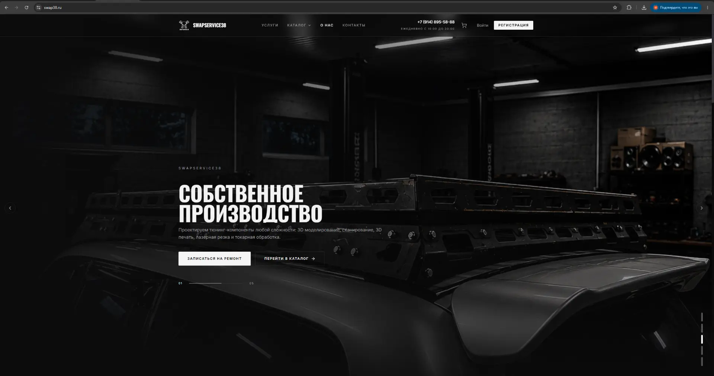
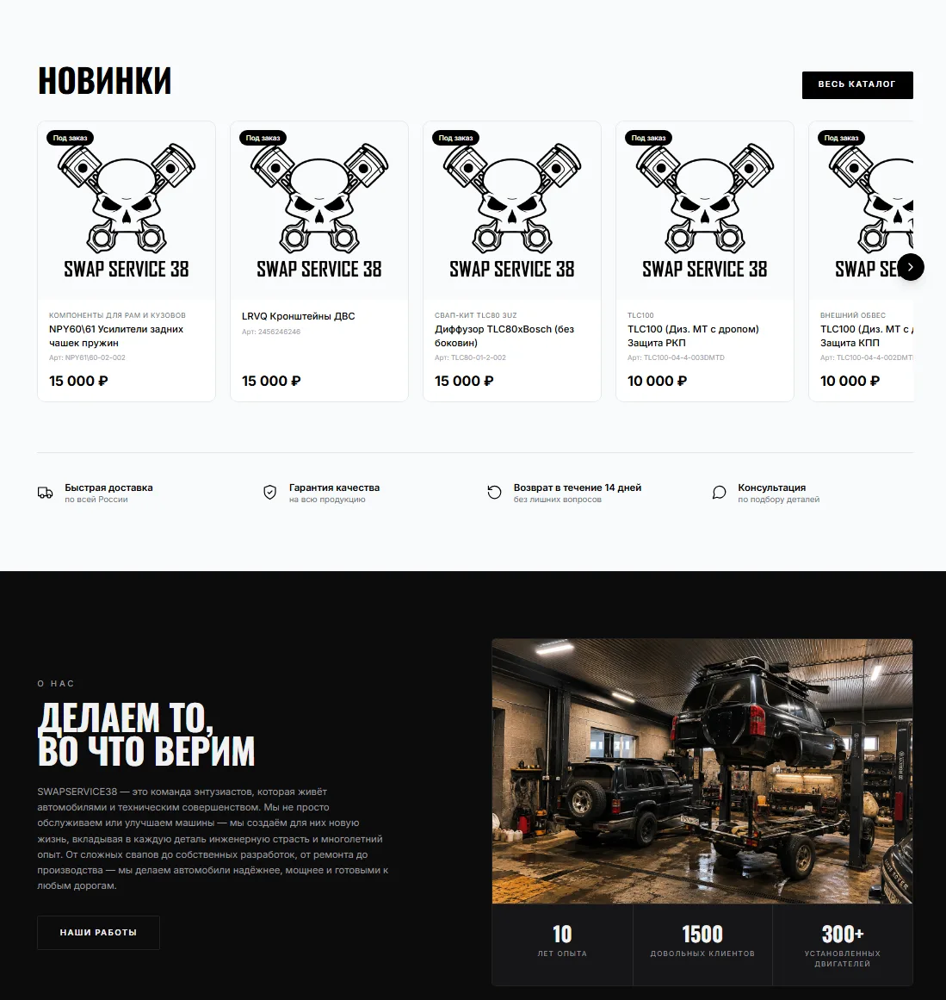
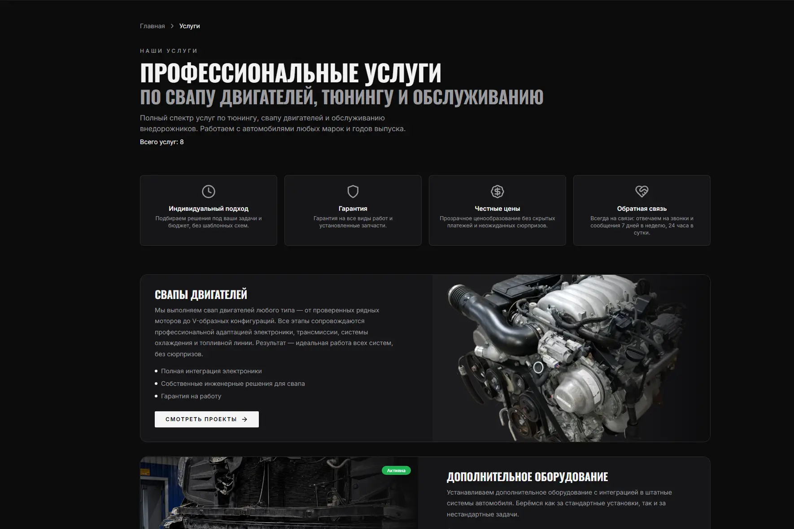
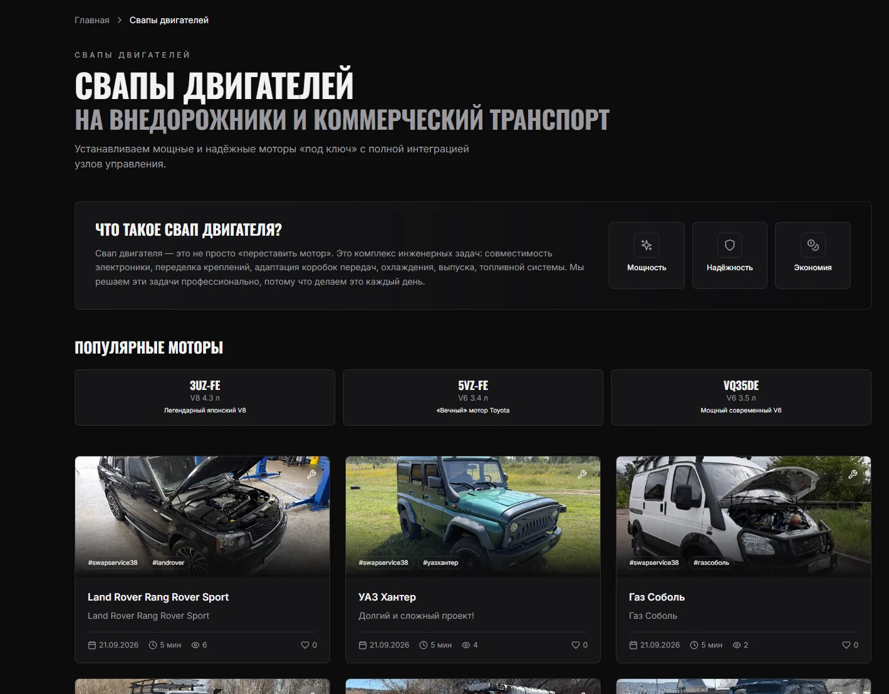
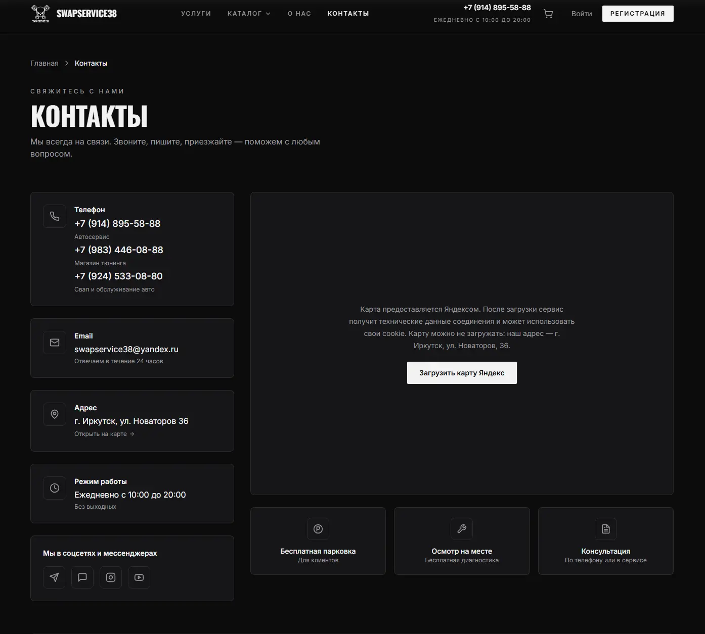
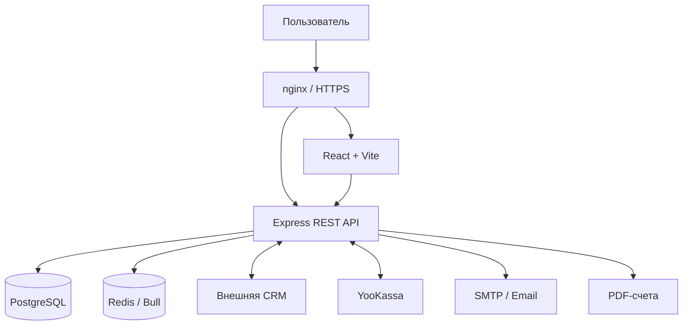

# SWAPSERVICE38

### Full-stack платформа для автомобильного сервиса, свапов и тюнинга

[](https://swap38.ru)


**[Рабочий сайт](https://swap38.ru)** · **[Архитектура](ARCHITECTURE.md)** · **[Установка](docs/INSTALLATION.md)** · **[Безопасность](SECURITY.md)**

---



**SWAPSERVICE38** — действующая коммерческая веб-платформа, разработанная с нуля для автомобильного бизнеса.

Проект объединяет интернет-магазин автомобильных комплектующих, каталог услуг, личный кабинет, систему заказов, онлайн-оплату, администрирование и интеграцию с отдельной CRM-системой.

> **Production:** https://swap38.ru  
> **Статус:** действующий коммерческий проект.

## О проекте

SWAPSERVICE38 специализируется на свапах двигателей и трансмиссий, ремонте и обслуживании автомобилей, производстве и установке тюнинговых компонентов.

Веб-платформа обеспечивает цифровое взаимодействие с клиентами: от знакомства с услугами и выбора комплектующих до оформления заказа, оплаты и обработки данных во внутренних системах компании.

Разработка охватывает полный цикл:

- Проектирование архитектуры приложения.
- Разработку frontend и backend.
- Моделирование базы данных.
- Реализацию API и бизнес-логики.
- Интеграцию платёжных и внешних сервисов.
- Контейнеризацию и развёртывание.
- Поддержку production-инфраструктуры.

## Интерфейс приложения

Интерфейс построен в минималистичной чёрно-белой стилистике с контрастной типографикой, адаптивными компонентами и акцентом на визуальную подачу автомобильных проектов.

### Интернет-магазин и собственная продукция



Каталог объединяет автомобильные комплектующие, компоненты для свапов и тюнинга, включая продукцию собственного производства.

Реализованы поиск, фильтрация, корзина, оформление заказов и получение информации о товарах через CRM.

### Услуги автосервиса



Отдельные страницы представляют основные направления работы компании: свапы, ремонт, техническое обслуживание, изготовление и установку компонентов, а также переоборудование автомобилей.

### Свапы двигателей и выполненные проекты



Специализированные страницы рассказывают об инженерных решениях, популярных двигателях и реализованных проектах. Материалы позволяют демонстрировать опыт компании и особенности выполненных работ.

### Контакты и взаимодействие с клиентами



Контактная страница объединяет способы связи, адрес, график работы, социальные сети и интеграцию с Яндекс Картами с загрузкой карты по действию пользователя.

## Функциональные возможности

### E-commerce

- Каталог товаров и услуг.
- Поиск и фильтрация.
- Корзина покупателя.
- Оформление заказов.
- История заказов.
- Получение информации о товарах и остатках из CRM.

### Пользовательская система

- Регистрация и авторизация.
- OAuth-интеграции.
- Личный кабинет.
- Управление персональными данными.
- Восстановление доступа.
- Пользовательские согласия.

### Заказы и платежи

- Онлайн-оплата через **YooKassa**.
- Банковские счета на оплату.
- Формирование PDF-документов.
- Учёт платёжных попыток.
- Обработка отмен и возвратов.
- Синхронизация заказов с CRM.
- Email-уведомления.

### Администрирование

- Управление контентом.
- Публикация статей и изображений.
- Управление услугами.
- Работа с заказами.
- Интеграция с внутренними бизнес-процессами.

## Технологический стек

| Компонент | Технологии |
|---|---|
| Frontend | React 18, TypeScript, Vite 5 |
| Стилизация | Tailwind CSS |
| Маршрутизация | React Router |
| Backend | Node.js, Express, TypeScript |
| API | REST |
| База данных | PostgreSQL 15 |
| ORM | Prisma 5 |
| Кеширование и очереди | Redis 7, Bull |
| Валидация | Zod |
| Платежи | YooKassa |
| PDF-документы | PDFKit |
| Email | Nodemailer, SMTP |
| Контейнеризация | Docker, Docker Compose |
| Веб-сервер | nginx |
| Инфраструктура | Linux VPS, HTTPS |
| Интеграции | CRM, OAuth, DaData |

## Архитектура

Приложение разделено на frontend и backend. Бизнес-логика и работа с данными сосредоточены на серверной стороне, а взаимодействие с CRM и внешними сервисами организовано через API и фоновые механизмы обработки событий.



### Работа с заказами

Система обрабатывает оформление заказов, платёжные состояния, синхронизацию с CRM и уведомления клиентов.

Для интеграционных событий используется **transactional outbox** и фоновые обработчики, позволяющие организовать повторную обработку при временных сбоях внешних систем.

Отдельные механизмы отвечают за идемпотентность операций, отмены и возвраты.

Подробное описание компонентов, потоков данных и бизнес-процессов приведено в [ARCHITECTURE.md](ARCHITECTURE.md).

## Структура репозитория

```text
swapservice38-website/
├── backend/
│   ├── prisma/                 # Схема БД и миграции
│   ├── src/                    # API и бизнес-логика
│   ├── tests/                  # Тесты
│   ├── Dockerfile
│   └── package.json
│
├── frontend/
│   ├── public/                 # Статические ресурсы
│   ├── src/                    # React-приложение
│   ├── Dockerfile
│   └── package.json
│
├── docs/
│   ├── screenshots/
│   │   ├── home.webp
│   │   ├── catalog.webp
│   │   ├── services.webp
│   │   ├── engine-swaps.webp
│   │   └── contacts.webp
│   └── INSTALLATION.md
│
├── docker-compose.yml
├── docker-compose.prod.yml
├── ARCHITECTURE.md
├── SECURITY.md
├── LICENSE
└── README.md
```

## Локальный запуск

Для разработки необходимы Node.js, npm, PostgreSQL, Redis и настроенные переменные окружения.

**Backend:**

```bash
cd backend
npm ci
npm run dev
```

**Frontend (в отдельном терминале):**

```bash
cd frontend
npm ci
npm run dev
```

Перед запуском требуется подготовить базу данных, Redis, Prisma и конфигурацию внешних интеграций.

Полное руководство: **[docs/INSTALLATION.md](docs/INSTALLATION.md)**.

## Тестирование и сборка

Backend:

```bash
cd backend
npm test
npm run build
```

Frontend:

```bash
cd frontend
npm run build
```

Backend использует Jest. Frontend собирается через TypeScript и Vite.

## Развёртывание

Production-инфраструктура использует Docker Compose, nginx, PostgreSQL и Redis.

Платформа развёрнута на Linux VPS и работает через HTTPS.

Рабочая конфигурация также включает серверные настройки сети, секретов, постоянных хранилищ и внешних интеграций, поэтому публичные Compose-файлы не являются полной автономной production-конфигурацией.

## Безопасность

Проект предусматривает серверную валидацию, авторизацию, разграничение доступа и защиту чувствительных операций.

Пароли, API-ключи, токены и другие секреты не должны храниться в публичном репозитории.

Для конфиденциального сообщения об уязвимостях предусмотрен документ **[SECURITY.md](SECURITY.md)**.

## Документация

| Документ | Назначение |
|---|---|
| [ARCHITECTURE.md](ARCHITECTURE.md) | Архитектура и бизнес-процессы |
| [docs/INSTALLATION.md](docs/INSTALLATION.md) | Установка и локальная разработка |
| [SECURITY.md](SECURITY.md) | Политика безопасности |
| [LICENSE](LICENSE) | Условия использования кода |

## Статус

**Production — запущен и используется.**

SWAPSERVICE38 продолжает развиваться как действующая платформа автомобильного бизнеса.

## Автор

**[Mikhail1708](https://github.com/Mikhail1708)**

Full-stack TypeScript development:

- Архитектура приложений.
- Backend и REST API.
- React frontend.
- PostgreSQL и Prisma.
- Интеграция внешних сервисов.
- Docker и production-развёртывание.

**Сайт:** https://swap38.ru

## Лицензия

Условия использования исходного кода определены в файле [LICENSE](LICENSE). Публичный доступ к репозиторию не предоставляет дополнительных прав на использование материалов проекта.

---

<p align="center">
  <strong>SWAPSERVICE38</strong>

  Automotive Engineering × Software Development
</p>
