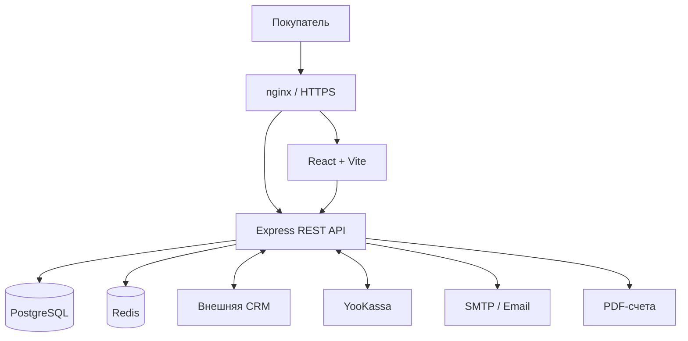

# SWAPSERVICE38

### Full-stack e-commerce платформа для автомобильного сервиса, свапов и тюнинга

[](https://swap38.ru)


**[Открыть сайт](https://swap38.ru)** · **[Архитектура](ARCHITECTURE.md)** · **[Установка](docs/INSTALLATION.md)** · **[Безопасность](SECURITY.md)**

---

## О проекте

**SWAPSERVICE38** — действующая коммерческая веб-платформа, разработанная для автомобильного сервиса, специализирующегося на свапах двигателей и трансмиссий, обслуживании автомобилей, изготовлении и установке тюнинговых компонентов.

Проект объединяет публичный сайт, интернет-магазин, личный кабинет, оформление и оплату заказов, систему администрирования и интеграцию с отдельной CRM.

Платформа разработана с нуля: от структуры базы данных и серверной бизнес-логики до пользовательского интерфейса, контейнеризации и развёртывания на Linux VPS.

> **Статус:** Production. Приложение развёрнуто и используется в реальном бизнесе. Это не демонстрационный макет или учебный интернет-магазин.

## Основные возможности

### Интернет-магазин

- Каталог автомобильных комплектующих и тюнинга.
- Поиск и фильтрация товаров.
- Корзина и оформление заказов.
- Получение данных о товарах и остатках из CRM.
- История заказов в личном кабинете.

### Пользователи

- Регистрация и авторизация.
- Личный кабинет и управление данными.
- OAuth-интеграции.
- Восстановление доступа к аккаунту.
- Управление пользовательскими согласиями.

### Заказы и платежи

- Онлайн-оплата через **YooKassa**.
- Оплата по банковскому счёту.
- Формирование счетов в PDF.
- Учёт платёжных попыток и состояний оплаты.
- Обработка отмен и возвратов.
- Синхронизация заказов с CRM.
- Email-уведомления о событиях заказа.

### Администрирование и контент

- Управление заказами.
- Управление услугами и материалами сайта.
- Публикация статей и изображений.
- Интеграция с внутренними процессами автосервиса.

## Технологический стек

| Уровень | Технологии |
|---|---|
| Frontend | React 18, TypeScript, Vite 5 |
| UI | Tailwind CSS, React Router |
| Backend | Node.js, Express, TypeScript |
| API | REST |
| Database | PostgreSQL 15 |
| ORM | Prisma 5 |
| Cache / Queues | Redis 7, Bull |
| Validation | Zod |
| Payments | YooKassa, банковские счета |
| Documents | PDFKit |
| Email | SMTP, Nodemailer |
| Infrastructure | Docker, Docker Compose, nginx |
| Hosting | Linux VPS, HTTPS |
| Integrations | CRM, OAuth, DaData |

## Архитектура

Frontend и backend разделены на самостоятельные приложения. PostgreSQL отвечает за постоянное хранение данных, Redis используется для кеширования и очередей задач, а внешняя CRM обслуживает складские и внутренние бизнес-процессы.



### Обработка заказов

Платформа поддерживает оформление заказов, оплату, взаимодействие с CRM и отправку уведомлений.

Для обработки интеграционных событий используются фоновые механизмы и transactional outbox. Это позволяет отделять операции с локальными данными от доставки событий во внешние системы и повторять обработку при временных сбоях.

Отдельное внимание уделено состояниям платежей, идемпотентности операций, отменам и возвратам.

**Подробное техническое описание:** [ARCHITECTURE.md](ARCHITECTURE.md).

## Структура репозитория

```text
swapservice38-website/
├── backend/
│   ├── prisma/           # Схема БД и миграции
│   ├── src/              # API и бизнес-логика
│   ├── tests/            # Backend-тесты
│   ├── Dockerfile
│   └── package.json
│
├── frontend/
│   ├── public/           # Статические ресурсы
│   ├── src/              # React-приложение
│   ├── Dockerfile
│   └── package.json
│
├── docs/                 # Документация
├── docker-compose.yml
├── docker-compose.prod.yml
├── ARCHITECTURE.md
├── SECURITY.md
├── LICENSE
└── README.md
```

## Локальная разработка

Для запуска необходимы:

- Node.js и npm.
- Docker с Docker Compose.
- PostgreSQL.
- Redis.
- Переменные окружения.

Приложения frontend и backend имеют отдельные зависимости и команды запуска.

```bash
# Backend
cd backend
npm ci
npm run dev
```

```bash
# Frontend (в другом терминале)
cd frontend
npm ci
npm run dev
```

Перед запуском необходимо подготовить базу данных, Redis, Prisma и конфигурацию окружения. Одних приведённых команд недостаточно для полной настройки приложения.

**Полная инструкция:** [docs/INSTALLATION.md](docs/INSTALLATION.md).

## Тестирование и сборка

Backend использует Jest, frontend собирается через TypeScript и Vite.

```bash
# Backend
cd backend
npm test
npm run build
```

```bash
# Frontend
cd frontend
npm run build
```

Наличие тестовой инфраструктуры не означает заявленного полного покрытия или гарантии отсутствия ошибок.

## Развёртывание

Production-инфраструктура использует Docker Compose, nginx, PostgreSQL и Redis.

Сервис развёрнут на Linux VPS. Для рабочего окружения используются отдельные настройки сетевого взаимодействия, секретов, хранилищ и интеграций.

Публичные Compose-файлы не являются полным самостоятельным описанием production-инфраструктуры и требуют адаптации.

**Рабочий сайт:** https://swap38.ru

## Безопасность

В проекте используются механизмы авторизации и разграничения доступа, серверная валидация, защита чувствительных операций, HTTPS и отдельная конфигурация секретов.

В репозитории не должны публиковаться действующие ключи API, пароли, токены, платёжные секреты и персональные данные клиентов.

Обнаруженные уязвимости следует сообщать конфиденциально.

**Политика безопасности:** [SECURITY.md](SECURITY.md).

## Документация

| Документ | Описание |
|---|---|
| [ARCHITECTURE.md](ARCHITECTURE.md) | Архитектура, компоненты, данные и интеграции |
| [docs/INSTALLATION.md](docs/INSTALLATION.md) | Подготовка окружения и локальный запуск |
| [SECURITY.md](SECURITY.md) | Сообщение об уязвимостях |
| [LICENSE](LICENSE) | Условия использования исходного кода |

## Статус проекта

**Production — запущен и используется.**

Проект продолжает развиваться: совершенствуются пользовательские сценарии, обработка заказов, интеграции и внутренние механизмы платформы.

## Автор

**Mikhail1708**

Full-stack разработка на TypeScript:

- Проектирование архитектуры.
- Frontend и backend.
- Моделирование баз данных.
- Интеграция внешних сервисов.
- Контейнеризация и развёртывание.
- Поддержка работающего приложения.

**GitHub:** [github.com/Mikhail1708](https://github.com/Mikhail1708)

**Сайт:** [swap38.ru](https://swap38.ru)

## Лицензия

Проект распространяется на условиях, указанных в файле [LICENSE](LICENSE). Публичный доступ к репозиторию не означает автоматического разрешения на свободное использование исходного кода.

---

<p align="center">
  <strong>SWAPSERVICE38</strong>

  Automotive engineering × Software development
</p>
